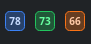

# BuildnBits.Usage (Linux)

> A Linux system-tray app for checking your remaining Codex, Grok, and Google Antigravity usage at a glance.

Linux/KDE companion to [BuildnBits.Usage for Windows](https://github.com/cicalooo/buildnbits-usage). Same remaining-percent rules and CLI-only login; Plasma **StatusNotifier** squares instead of Windows `NotifyIcon`.

## At a glance

- Shows Codex 5-hour and 7-day windows, Grok weekly usage, and Google Antigravity model quotas.
- Keeps three compact tray squares visible for the Codex, Grok, and Antigravity **remaining** percentages (green / orange / blue).
- Opens a compact status popup with every Antigravity quota pool, remaining time, reset times, refresh controls, and settings.
- Refreshes on startup, manual refresh, and roughly every 5 minutes by default. Provider results appear independently, so a slow CLI does not hold back the others.
- Supports 3-minute, 5-minute, and 10-minute update intervals from Settings or the tray menu.
- Stores usage metadata only—never tokens, cookies, prompts, or account credentials.

This is a Qt 6 / KDE Frameworks tray daemon. It is **not** a Plasma panel widget.

## Install

On Arch (and most Arch-based distros) from a terminal:

```bash
git clone https://github.com/cicalooo/buildnbits-usage-kde.git
cd buildnbits-usage-kde
./install.sh --start
```

That installs packages, builds, installs into `~/.local`, and starts the tray squares. Enable **Run at Startup** from any square → Settings.

| Command | What it does |
| --- | --- |
| `./install.sh` | Build and install for your user (`~/.local`) |
| `./install.sh --start` | Same, then launch |
| `./install.sh --uninstall` | Remove the user install |
| `./install.sh --system` | Install to `/usr` (uses sudo) |
| `make install` | Same as `./install.sh` without auto packages |

Then sign in to the CLIs you use (`codex`, `grok`, and/or `agy`). The app never asks for API keys.

### Arch package (from this tree)

```bash
cd packaging/arch
makepkg -si
```

### Other distros

`./install.sh` tries **dnf** (Fedora) and **apt** (Debian/Ubuntu). If your packages have different names, install Qt 6, Extra CMake Modules, KDE Frameworks 6 (`kstatusnotifieritem`, `kcoreaddons`, `kconfig`, `ki18n`, `kwindowsystem`) and LayerShellQt, then run `./install.sh` again.

## Screenshots

### Notification-area squares

Three StatusNotifier squares keep Codex (green), Grok (orange), and Antigravity (blue) remaining percentages visible without opening the popup. Each tile shows the lowest remaining window for that provider.



Click a square for that provider’s panel only (Codex 5-hour and 7-day, Grok weekly, or every Antigravity quota pool). Right-click for Settings, Refresh, and Quit.

## How it works

Plasma does not provide a supported API for arbitrary inline taskbar widgets. BuildnBits.Usage uses three StatusNotifierItem tray icons instead. Click any square to open the combined popup.

Other trays that host freedesktop StatusNotifier items (for example some Waybar or Hyprland setups) may show the icons; the target desktop is KDE Plasma 6.

## Providers

| Provider | Connection | What is shown | Authentication |
| --- | --- | --- | --- |
| **Codex** | `codex --sandbox read-only --ask-for-approval never app-server` | 5-hour and 7-day remaining usage, reset times | ChatGPT subscription login; API-key authentication is rejected |
| **Grok** | `grok --no-auto-update agent stdio` | Weekly remaining usage and reset time | CLI `cached_token` only |
| **Google Antigravity [agy]** | `agy -p /usage --output-format json` | Remaining quota for each model pool and reset times | Existing `agy` sign-in; credentials stay with the CLI |

### Codex

BuildnBits.Usage calls `initialize` and `account/rateLimits/read`. It recognizes usage windows by duration, including **300 minutes (5-hour)** and **10,080 minutes (7-day)**. Remaining usage is calculated as `100 - usedPercent`, and the Codex square shows the **lowest remaining** percentage across active windows.

### Grok

The app calls `x.ai/billing` through the Grok CLI. It never reads or stores `~/.grok/auth.json` or any other credentials.

### Google Antigravity [agy]

The app runs Antigravity's read-only `/usage` command in headless mode and parses its machine-readable `command.data.groups[].buckets[]` response. It records each quota pool separately and shows the lowest remaining pool on the tray square. The `/usage` command does not start an agent turn or spend model quota. If `agy` is not on `PATH`, that square stays empty or stale; this app never scrapes the IDE process or reads credentials.

## Privacy and cache

The cache contains only percentages, period timestamps, plan labels, and status:

```text
~/.local/share/BuildnBits/Usage/usage-cache.json
```

Tokens, cookies, prompts, and account credentials are never copied or logged.

Temporary refresh failures retain the last successful percentages and mark the status as stale.

Antigravity's one-shot `/usage` command is capped at 15 seconds. A timeout leaves its cached values visible as stale while Codex and Grok continue to update.

## Layout

| Path | Responsibility |
| --- | --- |
| `src/core` | Models, Codex/Grok/agy clients, JSON cache |
| `src/app` | StatusNotifier squares, per-provider popup, settings |
| `resources` | Desktop file and application icon |
| `install.sh` | One-command user install |
| `packaging/arch` | Arch `PKGBUILD` |

## Settings and future work

Settings—available from any tray square—cover launch at login, which squares to show, and the 3/5/10-minute refresh interval. Tokens and cookies are never stored in Settings.

A Plasma panel applet (true hover-on-panel) is out of scope for now and is tracked in [FUTURE.md](FUTURE.md).

## Manual environment checks

Where the host OS allows it, verify the following:

- Plasmashell restart, auto-hide panel, system-tray overflow, mixed DPI, sleep/resume, and light/dark themes.
- Three squares remain after hiding and re-showing a provider in Settings.
- Missing `agy` does not crash the app; Codex and Grok still refresh.
- Network loss, malformed JSON, and process timeouts leave last-good remaining percentages marked stale.

## License

MIT. Linux port derived from [KDECodexBar](https://github.com/rursache/KDECodexBar) / CodexBar; product rules match [BuildnBits.Usage](https://github.com/cicalooo/buildnbits-usage).
